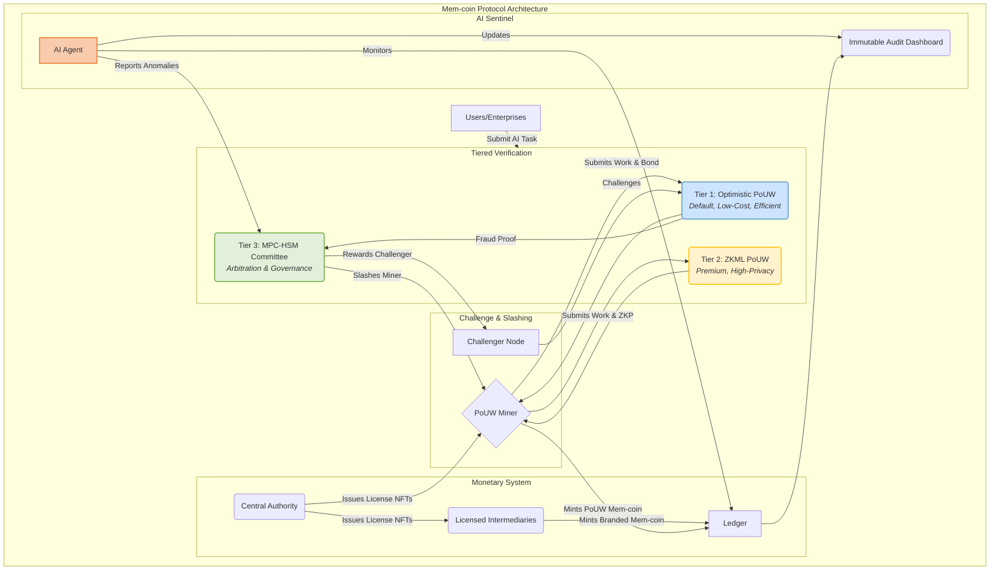

<h1>Mem-Coin Cryptocurrency Protocol</h1>
  
<strong>A Hybrid Verification Cryptocurrency for the Decentralized AI Ecosystem</strong>

  

    
    
    
  

Welcome to the official repository for the Mem-Coin Protocol, an open-source cryptocurrency revolutionizing the intersection of artificial intelligence, blockchain, and finance. This protocol introduces a hybrid verification architecture designed for efficiency, security, and real-world adoption.

The foundational data layer of our protocol is the `memvid` library, an innovative technology for highly compressed, verifiable data objects. For more information on this core component, please see the original implementation here: <https://github.com/Olow304/memvid>.

This repository is based on the principles outlined in the foundational whitepaper, "Architectural Simplification and Hardening of the Mem-Coin Protocol: A Hybrid Verification Approach".

## Introduction to the mem-coin Cryptocurrency

Mem-coin represents a significant evolution in blockchain design, engineered to address the critical challenges of cost, energy consumption, and scalability that face many current cryptocurrencies. The protocol is built on the groundbreaking idea of **Proof-of-Useful-Work (PoUW)**, where the energy spent to secure the network is not wasted on arbitrary puzzles but is instead used for productive, real-world tasks like training and running AI models.

However, the original blueprint faced a significant hurdle: the "prover's burden.". Requiring every computation to be verified by a computationally intensive Zero-Knowledge Proof (ZKP) created an unsustainable economic and energetic cost for network participants.

To solve this, Mem-coin implements a strategic pivot to a multi-layered, hybrid verification architecture that is more practical, efficient, and accessible.

## Core Architectural Pillars

The Mem-coin protocol is built on a sophisticated, multi-layered architecture designed for defense-in-depth security, efficiency, and regulatory compliance.

### 1. A Tiered, Hybrid Verification Model

To solve the "prover's burden," Mem-coin replaces the mandatory ZKML verification with a more flexible, tiered system.

* **Tier 1: Optimistic PoUW (The Efficiency Layer)**
    * This is the default mechanism for verifying work on the network.
    * Miners submit their AI computation results with a substantial economic bond (a stake of MEM tokens) rather than a costly ZKP.
    * The submission is "optimistically" assumed to be correct, and a 7-day challenge period begins.
    * This model dramatically reduces costs and power consumption, making participation accessible to those with standard GPU hardware.
    * Security is crypto-economic: honest work is rewarded, and fraudulent actors are punished by having their bond "slashed" (confiscated). A portion of the slashed bond is given to the "Challenger" who successfully proves the fraud, creating a "bounty hunter" system that makes the network self-policing.

* **Tier 2: ZKML PoUW (The Premium Privacy Layer)**
    * While Optimistic PoUW is the default, Zero-Knowledge Machine Learning (ZKML) is retained as a premium, on-demand feature.
    * This allows users, such as corporations with proprietary data or AI models, to pay a higher fee to have their computation verified with a ZKP, guaranteeing absolute privacy and computational integrity.

* **Tier 3: MPC-HSM Committee (The Arbitration & Governance Layer)**
    * To prevent the collusion risks associated with a federated group of verifiers, Mem-coin establishes a maximally secure committee for high-stakes governance and arbitration.
    * This committee uses **Secure Multi-Party Computation (MPC)**, where a single private key is split into "shards" held by committee members. A signature requires a threshold of members to interact, but the full key is never reconstructed, making collusion cryptographically impractical.
    * Each member's key shard is further protected within a **Hardware Security Module (HSM)**, a physical, tamper-resistant device, providing an unparalleled level of security against both internal collusion and external hacks.

### 2. A Regulated, Two-Tier Monetary System

To bridge the gap between decentralized innovation and traditional finance, Mem-coin introduces a regulated, two-tier monetary system inspired by Central Bank Digital Currency (CBDC) models.

* **Tier 1: The Central Monetary Authority** An oversight body, analogous to a central bank, that sets monetary policy and issues minting licenses.
* **Tier 2: Licensed Intermediaries and Producers** This includes both regulated financial institutions (e.g., commercial banks) and individual citizens who "mint" new currency by performing PoUW.
* **Minting Licenses as NFTs** The central authority issues licenses to mint new currency in the form of Non-Fungible Tokens (NFTs). These NFTs act as a verifiable, on-chain credential required for minting.
* **Branded Insignia NFTs** Every block of newly minted Mem-coin is accompanied by a unique "Insignia NFT" that identifies its origin—whether from a specific bank or an individual PoUW producer. This creates a permanent, transparent, and auditable record of the entire money supply.

### 3. The AI Sentinel

An autonomous, generative AI agent acts as a continuous security monitor for the entire network.

* **Advanced Anomaly Detection**: The Sentinel is trained on the patterns of legitimate network activity and can identify fraudulent or suspicious behavior that deviates from this norm in real-time.
* **Immutable Audit Dashboard**: Every piece of data the Sentinel analyzes and every alert it generates is hashed and stored on the blockchain. This creates a tamper-proof, fully transparent audit trail accessible to regulators and the public via an "International Monetary Tracking Dashboard".

## Getting Started

This repository will contain the open-source implementation of the Mem-coin protocol. We are in the early stages of development and welcome contributors who are passionate about building the future of decentralized AI and finance.
## Project Action Log

### Status Key
* ✅ **Completed**
* 🟢 **On Track**
* 🟡 **At Risk / Due Soon**
* 🔴 **Overdue / Blocked**

| Status | Task / Action Item | Assigned To | Due Date | Notes |
|:---:|---|---|---|---|
| ✅ | Submit Draft RFC for Mem-Vid Protocol | @Rodney | YYYY-MM-DD | Pending. |
| ✅ | Draft initial whitepaper for Mem-Vid Protocol | @Rodney | 2025-08-2 | First draft complete. |
| ✅ | Set up GitHub repository and initial README.md | @Rodney | 2025-08-2 | First draft complete. |
| 🔴 | Set up community Discord server | @CommunityManager | YYYY-MM-DD | Pending. |
| 🟡 | Design the core architecture Mermaid diagram | @DevTeam | YYYY-MM-DD | Pending. |
| 🟢 | Create project logo and branding assets | @Designer | YYYY-MM-DD | Pending. |
| 🟢 | Implement the base Optimistic PoUW module | @LeadDev | YYYY-MM-DD | Pending. |
| 🟢 | Develop smart contracts for the MPC-HSM Committee | @CryptoTeam | YYYY-MM-DD | Pending. |

---

### How to Use

* **To update status:** Replace the emoji in the `Status` column. Use `✅` for completed items.
* **To assign tasks:** Use GitHub usernames (e.g., `@username`) to notify team members.
* **Customize:** You can easily add, remove, or rename columns to fit your project's needs.
## References

* **Memvid Library**: The core data object technology for the protocol. <https://github.com/Olow304/memvid>
* **Architectural Whitepaper**: The foundational paper detailing the hybrid verification architecture. [Mem-Coin Whitepaper](https://github.com/rodneypuplampu/mem-coin/blob/main/docs/Mem-Coin%20Protocol_A_Hybid_Verification_Cryptocurrency_Architeture.pdf)
